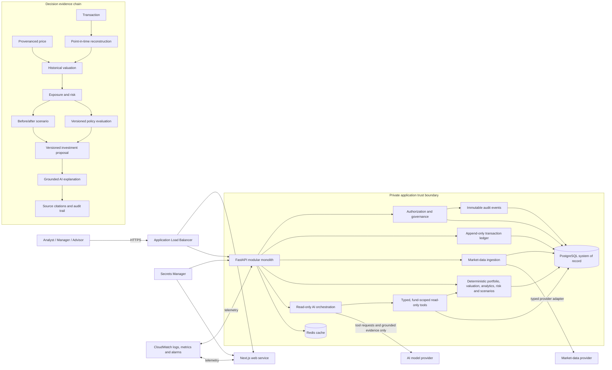

# HawkFundOS system architecture

## Architectural invariants

- PostgreSQL, not Redis or the AI provider, is the authoritative record.
- Transactions, source observations, proposal history, and audit events are append-oriented.
- Every point-in-time calculation uses explicit cutoffs, versions, and canonical input hashes.
- The model cannot mutate the portfolio or calculate financial metrics; it can only invoke the
  allowlisted, authorized read-only tools and explain returned evidence.
- Only the load balancer is public in AWS. ECS tasks, RDS, and ElastiCache remain in private subnets.
